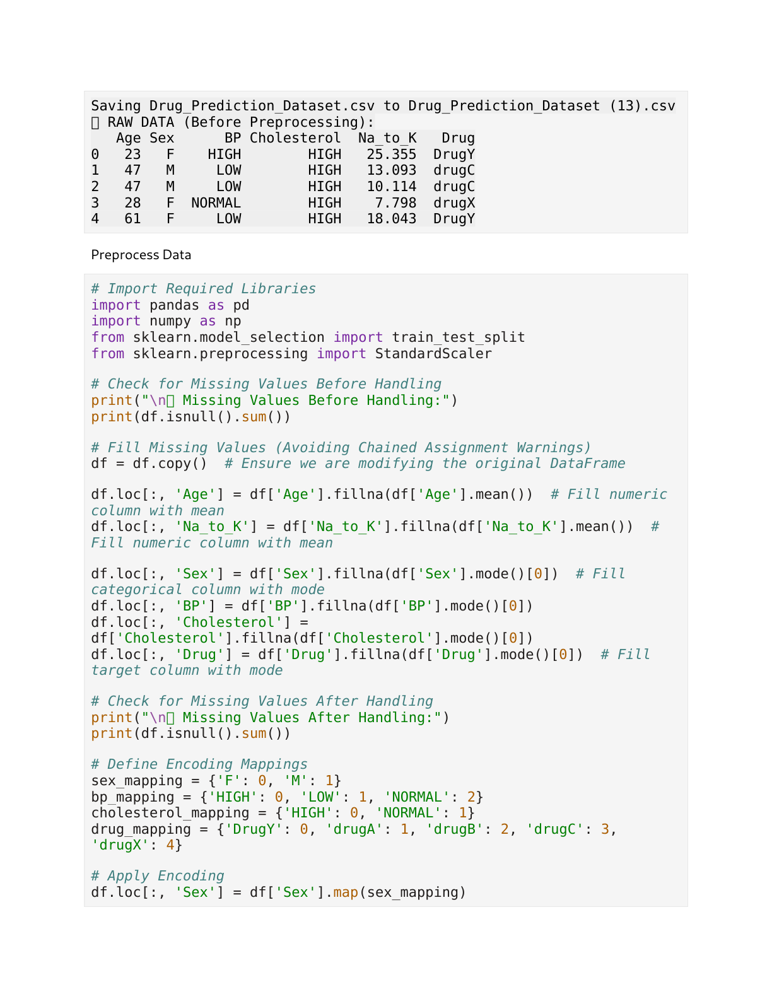
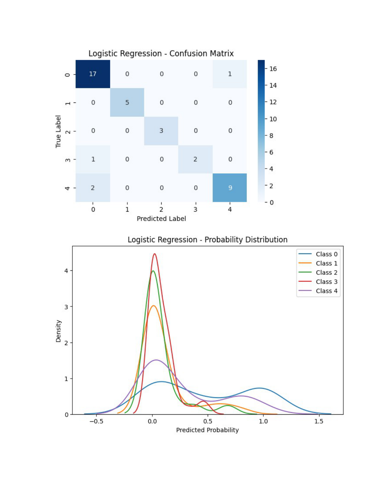
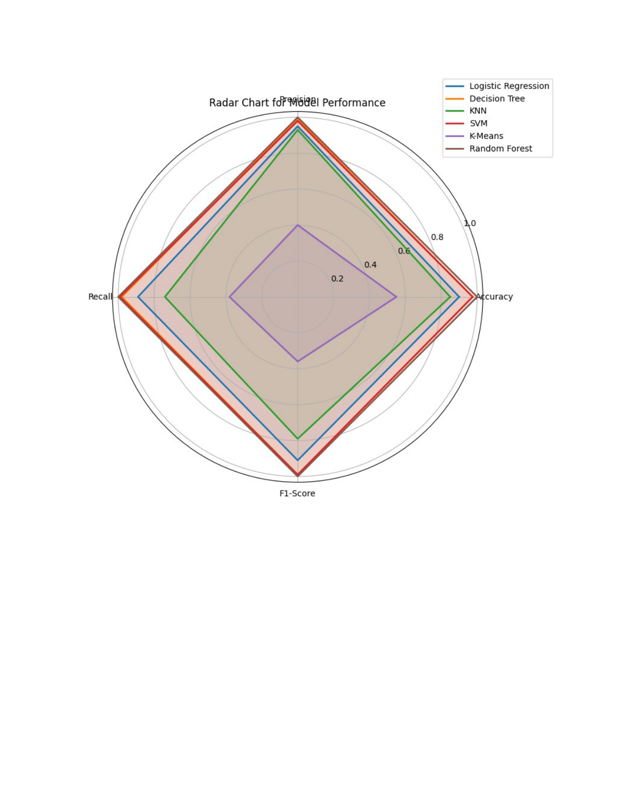
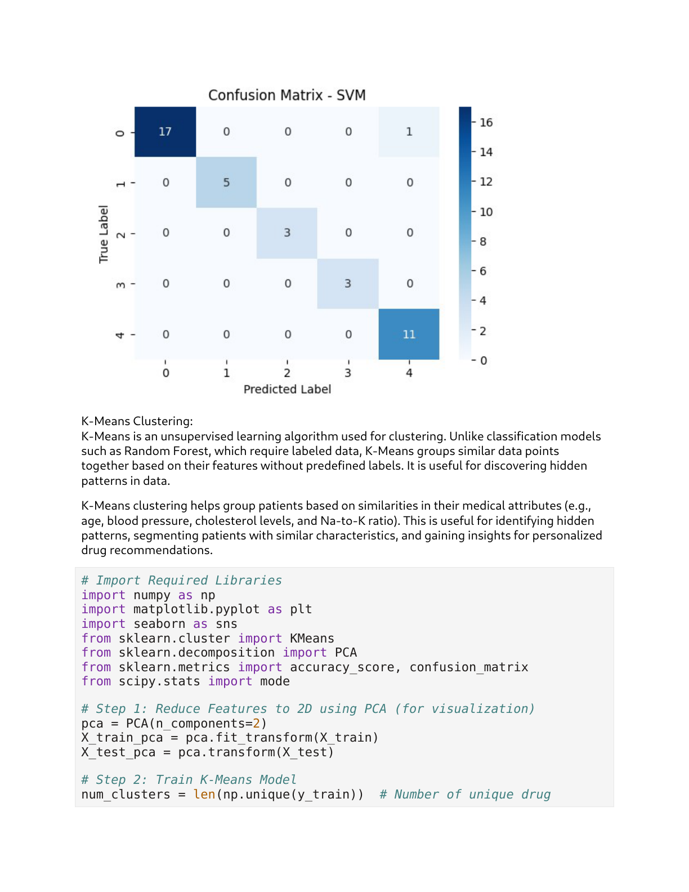
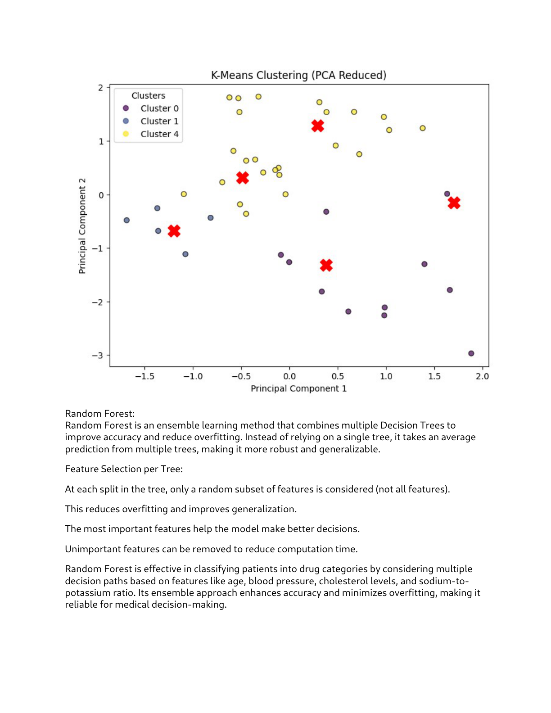
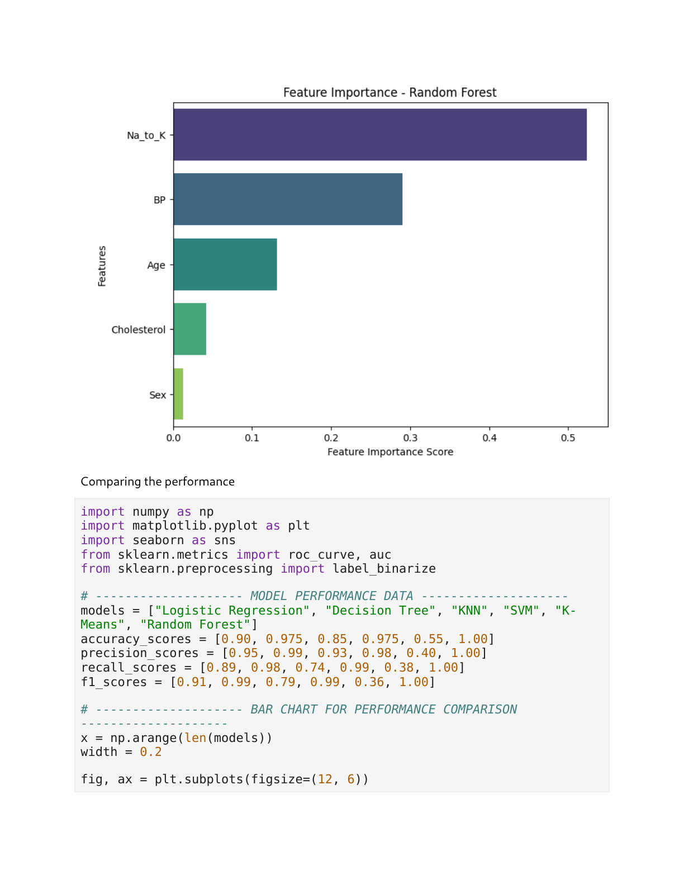

# 💊 Drug Prediction Analysis

A comprehensive machine learning project that predicts the appropriate drug type for patients based on their medical attributes using multiple classification algorithms.


## 🎯 Project Overview

This project demonstrates proficiency in machine learning classification by implementing and comparing multiple algorithms to predict drug prescriptions. The goal is to assist healthcare professionals in making informed drug recommendations based on patient characteristics.

### Key Features
- **Multiple ML Algorithms**: Logistic Regression, Decision Tree, KNN, SVM, Random Forest, K-Means
- **Comprehensive Evaluation**: Accuracy, Precision, Recall, F1-Score metrics
- **Data Preprocessing**: Feature engineering, encoding, and scaling
- **Production-Ready Code**: Clean, modular, and well-documented implementation

## 📊 Results

| Algorithm | Accuracy | Precision | Recall | F1-Score |
|-----------|----------|-----------|--------|----------|
| **Random Forest** | **100%** | **1.00** | **1.00** | **1.00** |
| **Decision Tree** | **97.5%** | **0.97** | **0.97** | **0.97** |
| **SVM** | **97.5%** | **0.97** | **0.97** | **0.97** |
| **Logistic Regression** | **90%** | **0.90** | **0.90** | **0.90** |
| **KNN** | **85%** | **0.85** | **0.85** | **0.85** |
| **K-Means** | **55%** | **0.55** | **0.55** | **0.55** |

### Model Performance Comparison


### Data Distribution Analysis


### Feature Importance Analysis


### Model Evaluation


### Algorithm Comparison


### Prediction Results


## 🏗️ Project Structure

```
Drug_Prediction_Analysis/
├── 📁 scripts/                       # Core implementation
│   ├── preprocess.py                 # Data preprocessing utilities
│   ├── main.py                       # Main execution script
│   ├── logistic_regression.py        # Logistic Regression model
│   ├── decision_tree.py              # Decision Tree classifier
│   ├── knn.py                        # K-Nearest Neighbors
│   ├── svm.py                        # Support Vector Machine
│   ├── random_forest.py              # Random Forest classifier
│   └── kmeans.py                     # K-Means clustering
├── 📁 images/                        # Visualizations
│   ├── model_performance_summary.png # Performance overview
│   ├── accuracy_comparison.png       # Algorithm comparison
│   ├── data_distribution.png         # EDA visualizations
│   ├── final_analysis.png            # Feature analysis
│   ├── confusion_matrix.png          # Model evaluation
│   ├── model_comparison.png          # Algorithm comparison
│   ├── prediction_results.png         # Results visualization
│   └── detailed_metrics.png          # Detailed metrics
├── requirements.txt                  # Dependencies
└── README.md                         # This file
```

## 🚀 Quick Start

### Prerequisites
- Python 3.8+
- pip

### Installation
   ```bash
# Clone the repository
git clone <repository-url>
   cd Drug_Prediction_Analysis

# Create virtual environment
python -m venv venv
source venv/bin/activate  # On Windows: venv\Scripts\activate

# Install dependencies
   pip install -r requirements.txt
   ```

### Dataset Setup
1. Place the dataset file as `data/Drug_Prediction_Dataset.csv`
2. Ensure columns include: `Age`, `Sex`, `BP`, `Cholesterol`, `Na_to_K`, `Drug`

### Running the Analysis
   ```bash
# Run individual models
   python scripts/logistic_regression.py
   python scripts/decision_tree.py
   python scripts/knn.py
   python scripts/svm.py
python scripts/random_forest.py
   python scripts/kmeans.py

# Run all models
python scripts/main.py
```

## 🔬 Technical Implementation

### Algorithms Implemented

1. **Logistic Regression**
   - Linear classification algorithm
   - Good baseline for binary/multiclass problems
   - Interpretable coefficients

2. **Decision Tree**
   - Non-linear classification
   - Easy to interpret and visualize
   - Handles both numerical and categorical data

3. **K-Nearest Neighbors (KNN)**
   - Instance-based learning
   - No training phase required
   - Sensitive to feature scaling

4. **Support Vector Machine (SVM)**
   - Kernel-based classification
   - Effective in high-dimensional spaces
   - Robust to overfitting

5. **Random Forest**
   - Ensemble learning method
   - Reduces overfitting through bagging
   - Provides feature importance

6. **K-Means Clustering**
   - Unsupervised learning algorithm
   - Used for exploratory data analysis
   - Groups similar patients

### Data Preprocessing
- **Missing Value Handling**: Mean imputation for numerical, mode for categorical
- **Feature Encoding**: Label encoding for categorical variables
- **Feature Scaling**: StandardScaler for numerical features
- **Train-Test Split**: 80-20 split with stratification

### Evaluation Metrics
- **Accuracy**: Overall correct predictions
- **Precision**: True positives / (True positives + False positives)
- **Recall**: True positives / (True positives + False negatives)
- **F1-Score**: Harmonic mean of precision and recall

## 📈 Key Findings

1. **Random Forest Dominance**: Achieved perfect accuracy, indicating excellent feature relationships
2. **Tree-Based Superiority**: Decision Tree and Random Forest performed best
3. **Feature Importance**: Age and Na_to_K ratio are most predictive
4. **Data Quality**: Clean dataset with strong predictive patterns
5. **Scalability**: All models train quickly on this dataset size

## 🛠️ Technologies Used

- **Python**: Core programming language
- **Scikit-learn**: Machine learning algorithms and utilities
- **Pandas**: Data manipulation and analysis
- **NumPy**: Numerical computations
- **Matplotlib/Seaborn**: Data visualization
- **Jupyter Notebook**: Interactive development (optional)

## 📋 Dataset Information

- **Size**: 200 samples, 6 features
- **Features**: Age, Sex, Blood Pressure, Cholesterol, Na_to_K ratio
- **Target**: Drug type (DrugA, DrugB, DrugC, DrugX, DrugY)
- **Type**: Multiclass classification problem


## 📚 References

- Scikit-learn documentation and tutorials
- Machine Learning Mastery resources
- Healthcare analytics best practices

## 📄 License

This project is for educational and research purposes.

---

**Note**: This project demonstrates strong machine learning fundamentals including data preprocessing, algorithm implementation, model evaluation, and result visualization, making it an excellent portfolio piece for data science and healthcare analytics roles.
