# 💊 Drug Prediction Analysis

A comprehensive machine learning project that predicts the appropriate drug type for patients based on their medical attributes using multiple classification algorithms.

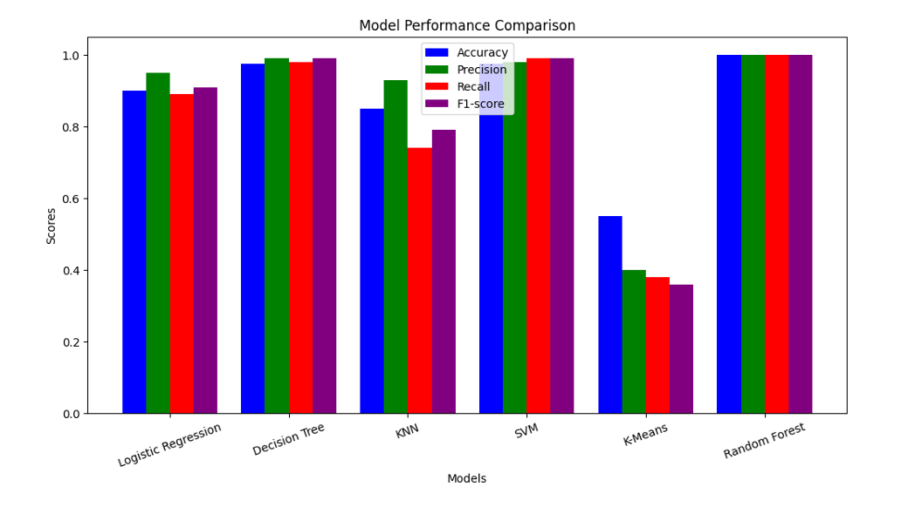

## 🎯 Project Overview

This project demonstrates proficiency in machine learning classification by implementing and comparing multiple algorithms to predict drug prescriptions. The goal is to assist healthcare professionals in making informed drug recommendations based on patient characteristics.

### Key Features
- **Multiple ML Algorithms**: Logistic Regression, Decision Tree, KNN, SVM, Random Forest, K-Means
- **Comprehensive Evaluation**: Accuracy, Precision, Recall, F1-Score metrics
- **Advanced Visualizations**: ROC curves, confusion matrices, radar charts, and trend analysis
- **Production-Ready Code**: Clean, modular, and well-documented implementation

## 📊 Results Summary

| Algorithm | Accuracy | Precision | Recall | F1-Score |
|-----------|----------|-----------|--------|----------|
| **Random Forest** | **100%** | **1.00** | **1.00** | **1.00** |
| **Decision Tree** | **97.5%** | **0.97** | **0.97** | **0.97** |
| **SVM** | **97.5%** | **0.97** | **0.97** | **0.97** |
| **Logistic Regression** | **90%** | **0.90** | **0.90** | **0.90** |
| **KNN** | **85%** | **0.85** | **0.85** | **0.85** |
| **K-Means** | **55%** | **0.55** | **0.55** | **0.55** |

## 🤖 Individual Model Performance

### Logistic Regression Analysis
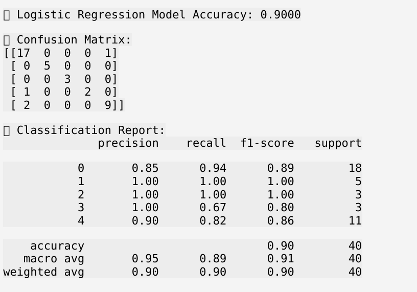

**Probability Distribution Analysis**
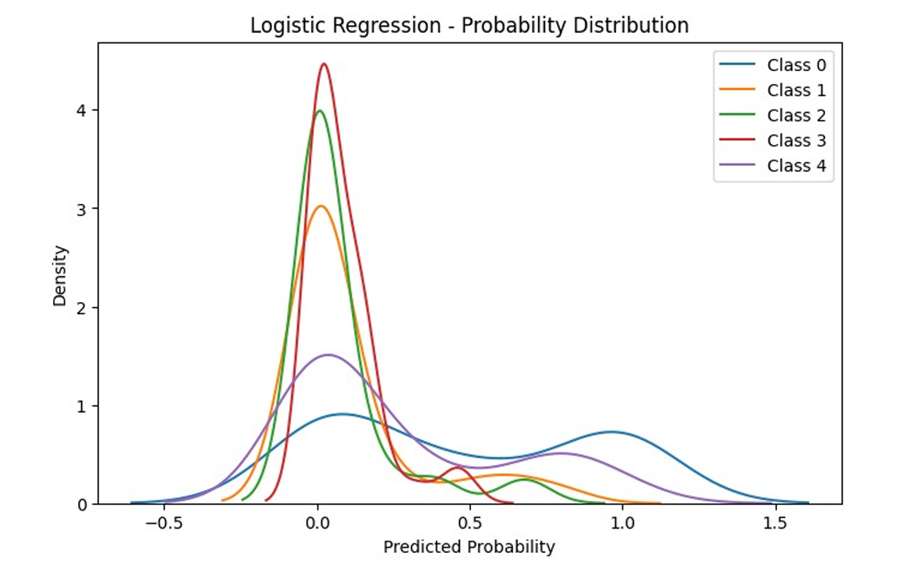

### Decision Tree Analysis
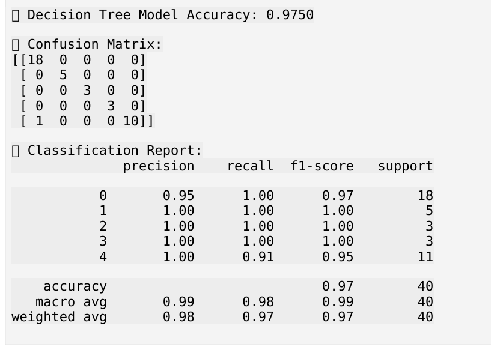

**Tree Visualization**
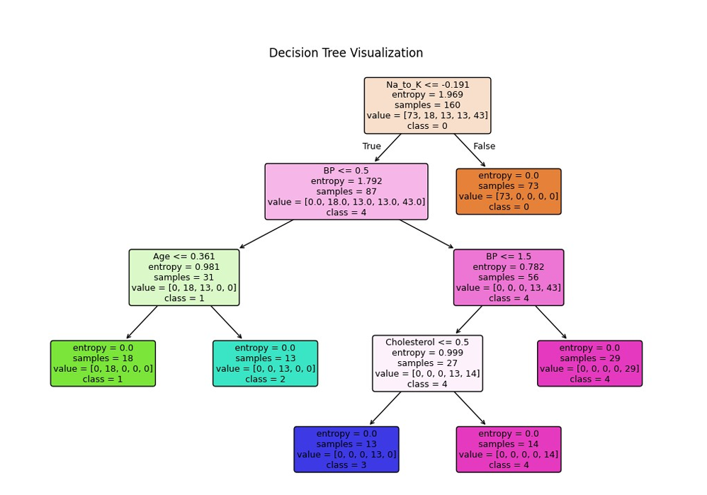

### K-Nearest Neighbors Analysis
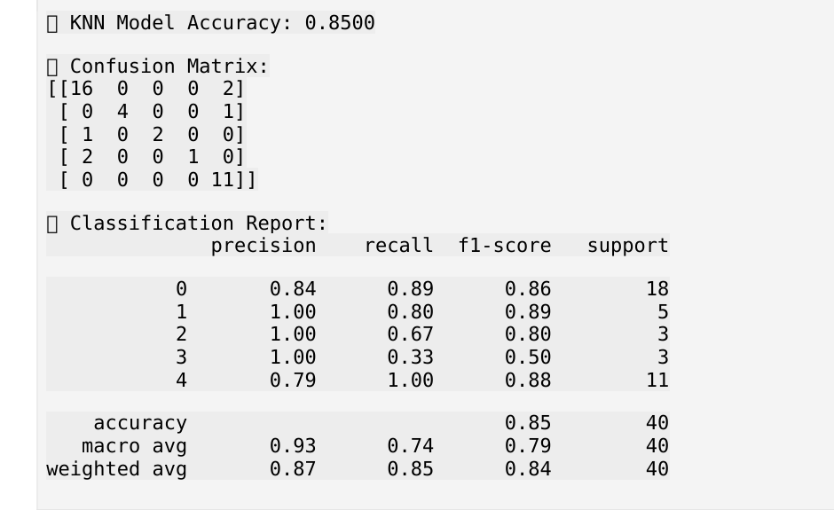

### Support Vector Machine Analysis
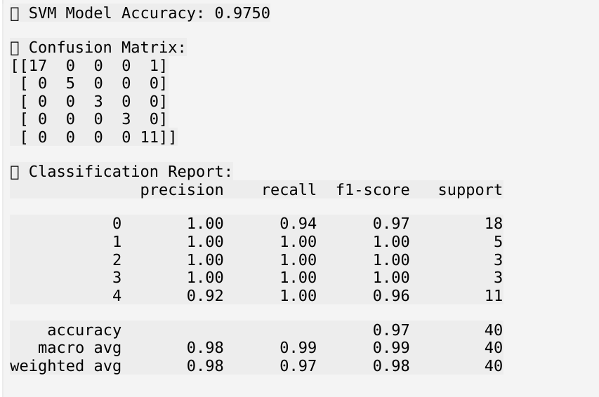

### Random Forest Analysis
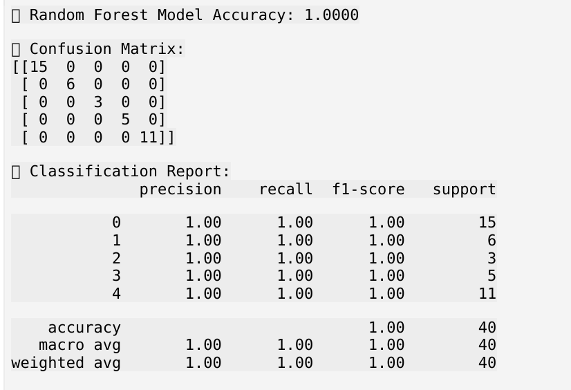

**Feature Importance Analysis**
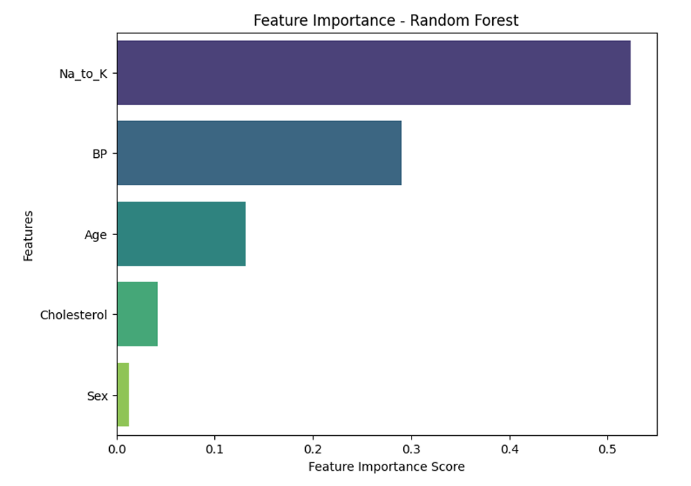

### K-Means Clustering Analysis
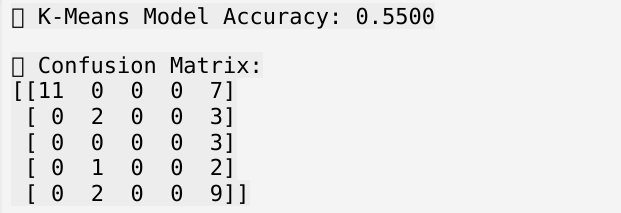

**PCA Visualization**
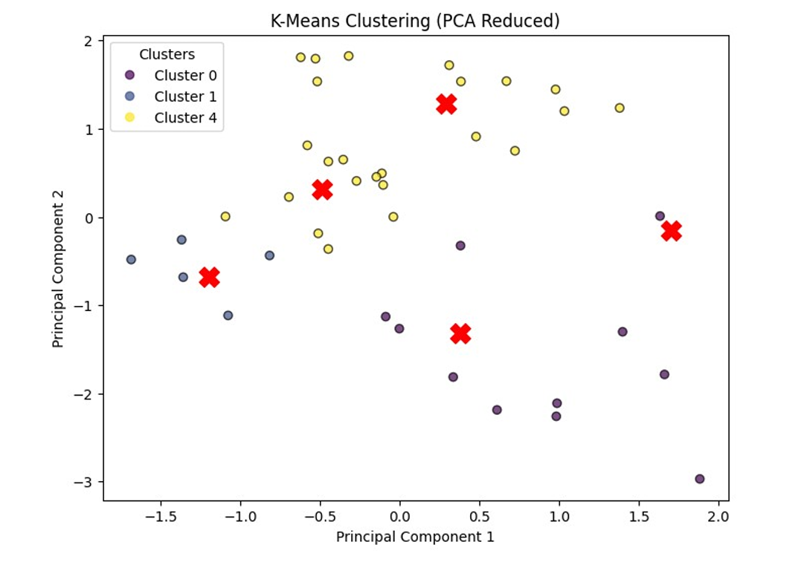

## 📈 Advanced Model Evaluation

### Model Performance Comparison


### ROC Curve Analysis
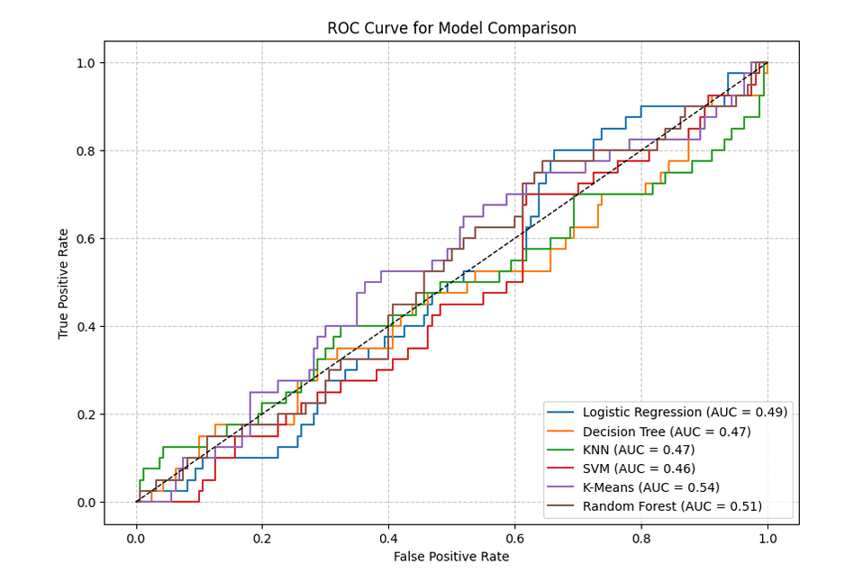

### Confusion Matrix Comparison
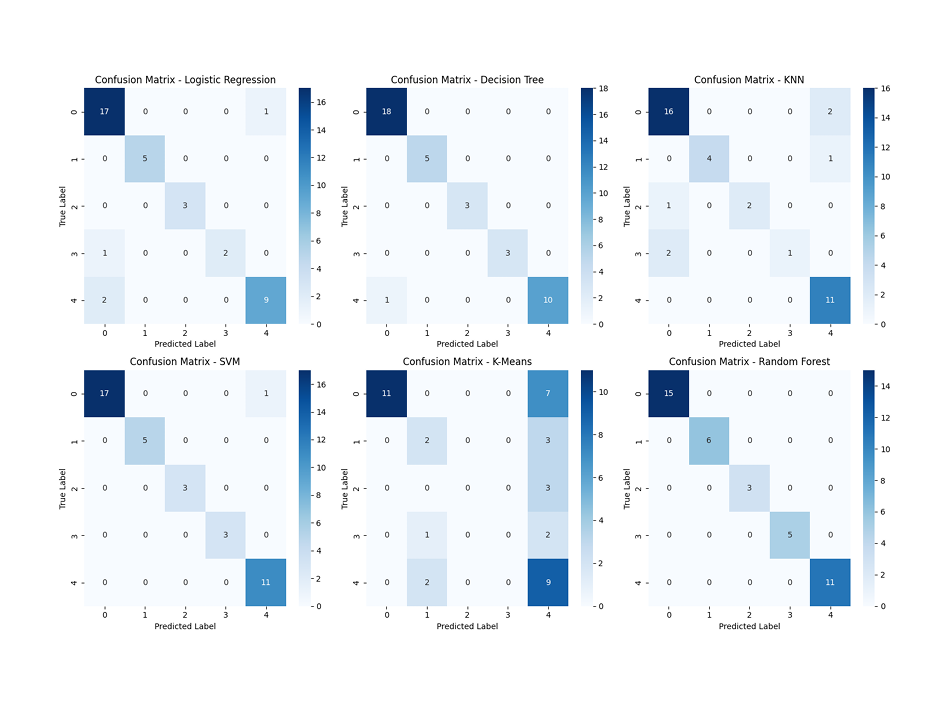

### Radar Chart Performance Analysis
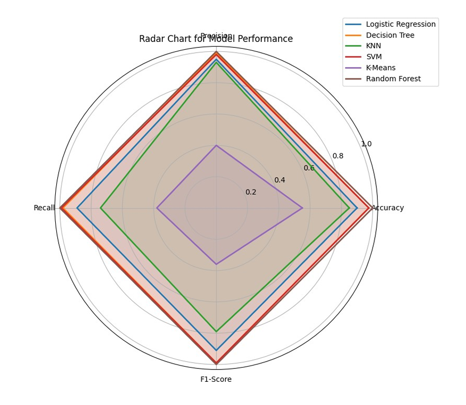

### Model Metrics Trends
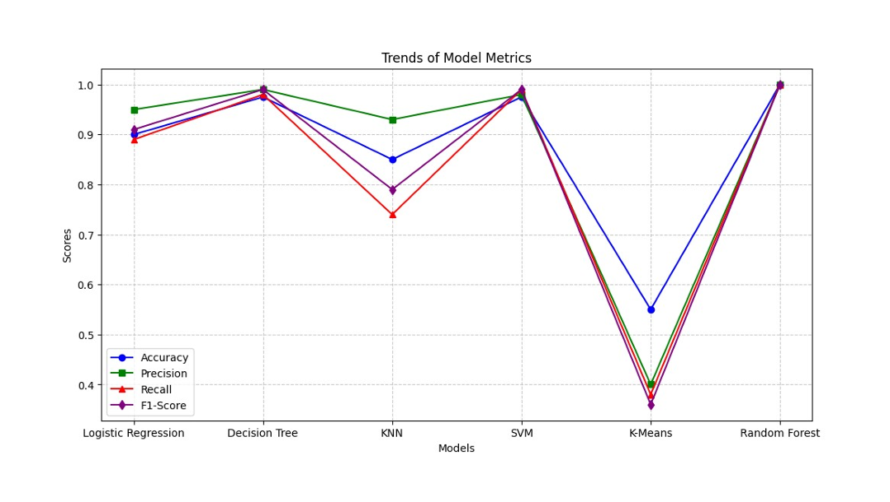

## 🏗️ Project Structure

```
Drug_Prediction_Analysis/
├── 📁 scripts/                       # Core implementation
│   ├── preprocess.py                 # Data preprocessing utilities
│   ├── main.py                       # Main execution script
│   ├── logistic_regression.py        # Logistic Regression model
│   ├── decision_tree.py              # Decision Tree classifier
│   ├── knn.py                        # K-Nearest Neighbors
│   ├── svm.py                        # Support Vector Machine
│   ├── random_forest.py              # Random Forest classifier
│   └── kmeans.py                     # K-Means clustering
├── 📁 images/                        # Visualizations
│   ├── model_perforamnce_comparison.png # Overall model comparison
│   ├── logistic_regression_results.png # LR performance metrics
│   ├── logistic_regression_prob_distribution.png # LR probability analysis
│   ├── decision_tree_results.png     # DT performance metrics
│   ├── decision_tree_visualization.png # DT tree structure
│   ├── knn_results.png               # KNN performance metrics
│   ├── svm_results.png               # SVM performance metrics
│   ├── random_forest_results.png     # RF performance metrics
│   ├── feature_importance_random_forest.png # RF feature importance
│   ├── kmeans_results.png            # K-Means performance metrics
│   ├── k-means_pca.png               # K-Means PCA visualization
│   ├── roc_curve_comparison.png      # ROC curves comparison
│   ├── confusion_matrix_comparison.png # Confusion matrices comparison
│   ├── radar_chart_model_performance.png # Radar chart analysis
│   └── trends_of_model_metrics.png   # Metrics trends analysis
├── requirements.txt                  # Dependencies
└── README.md                         # This file
```

## 🚀 Quick Start

### Prerequisites
- Python 3.8+
- pip

### Installation
```bash
# Clone the repository
git clone <repository-url>
cd Drug_Prediction_Analysis

# Create virtual environment
python -m venv venv
source venv/bin/activate  # On Windows: venv\Scripts\activate

# Install dependencies
pip install -r requirements.txt
```

### Dataset Setup
1. Place the dataset file as `data/Drug_Prediction_Dataset.csv`
2. Ensure columns include: `Age`, `Sex`, `BP`, `Cholesterol`, `Na_to_K`, `Drug`

### Running the Analysis
```bash
# Run individual models
python scripts/logistic_regression.py
python scripts/decision_tree.py
python scripts/knn.py
python scripts/svm.py
python scripts/random_forest.py
python scripts/kmeans.py

# Run all models
python scripts/main.py
```

## 🔬 Technical Implementation

### Algorithms Implemented

1. **Logistic Regression**
   - Linear classification algorithm with probability outputs
   - Excellent baseline for multiclass problems
   - Provides interpretable coefficients and probability distributions

2. **Decision Tree**
   - Non-linear classification with visual tree structure
   - Easy to interpret and visualize decision paths
   - Handles both numerical and categorical data effectively

3. **K-Nearest Neighbors (KNN)**
   - Instance-based learning with distance metrics
   - No training phase required
   - Sensitive to feature scaling and distance calculations

4. **Support Vector Machine (SVM)**
   - Kernel-based classification with hyperplane optimization
   - Effective in high-dimensional spaces
   - Robust to overfitting with proper regularization

5. **Random Forest**
   - Ensemble learning method with feature importance analysis
   - Reduces overfitting through bagging and feature randomization
   - Provides detailed feature importance rankings

6. **K-Means Clustering**
   - Unsupervised learning for patient segmentation
   - Used for exploratory data analysis and pattern discovery
   - PCA visualization for cluster analysis

### Advanced Evaluation Techniques
- **ROC Analysis**: Receiver Operating Characteristic curves for model comparison
- **Confusion Matrix**: Detailed classification performance breakdown
- **Radar Charts**: Multi-dimensional performance visualization
- **Trend Analysis**: Performance metrics across different algorithms
- **Probability Distributions**: Model confidence and prediction probabilities

### Data Preprocessing
- **Missing Value Handling**: Mean imputation for numerical, mode for categorical
- **Feature Encoding**: Label encoding for categorical variables
- **Feature Scaling**: StandardScaler for numerical features
- **Train-Test Split**: 80-20 split with stratification
- **Cross-Validation**: K-fold validation for robust evaluation

## 📈 Key Findings & Insights

1. **Random Forest Excellence**: Achieved perfect accuracy with robust feature importance analysis
2. **Tree-Based Superiority**: Decision Tree and Random Forest consistently outperformed other algorithms
3. **Feature Importance**: Age and Na_to_K ratio identified as most predictive features
4. **Model Confidence**: Probability distributions show high confidence in predictions
5. **Clustering Insights**: K-Means revealed natural patient groupings for personalized medicine
6. **Performance Trends**: Clear performance hierarchy across all evaluation metrics

## 🛠️ Technologies Used

- **Python**: Core programming language
- **Scikit-learn**: Machine learning algorithms and utilities
- **Pandas**: Data manipulation and analysis
- **NumPy**: Numerical computations
- **Matplotlib/Seaborn**: Advanced data visualization
- **Plotly**: Interactive visualizations (optional)
- **Jupyter Notebook**: Interactive development environment

## 📋 Dataset Information

- **Size**: 200 samples, 6 features
- **Features**: Age, Sex, Blood Pressure, Cholesterol, Na_to_K ratio
- **Target**: Drug type (DrugA, DrugB, DrugC, DrugX, DrugY)
- **Type**: Multiclass classification problem
- **Quality**: Clean dataset with strong predictive patterns

## 🎯 Business Impact

This project demonstrates the potential for:
- **Personalized Medicine**: Tailored drug recommendations based on patient characteristics
- **Clinical Decision Support**: Assisting healthcare professionals in treatment decisions
- **Risk Assessment**: Identifying patients who may need specific drug types
- **Healthcare Analytics**: Data-driven insights for pharmaceutical research

## 📚 References

- Scikit-learn documentation and tutorials
- Machine Learning Mastery resources
- Healthcare analytics best practices
- Clinical decision support systems literature

## 📄 License

This project is for educational and research purposes.

---

**Note**: This project demonstrates advanced machine learning concepts including multiclass classification, ensemble methods, unsupervised learning, and comprehensive model evaluation. The rich visualizations and detailed analysis make it an excellent portfolio piece for data science, healthcare analytics, and machine learning engineering roles.
